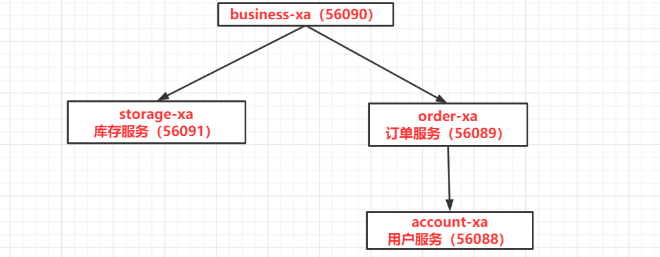
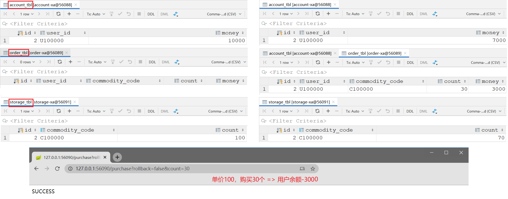

1.  https://github.com/seata/seata-samples/tree/master/seata-at 
2.   https://www.jianshu.com/p/ea454a710908?from=timeline 

# Sample of Seata AT mode

Spring Cloud 中使用 Seata，使用 Feign 实现远程调用，使用 Spring JDBC 访问 MySQL 数据库



# 四个服务分别创建四个数据库



## seata-server

```bash
docker run \
--name seata_server_dtx_official_xa \
-p 60000:8091 \
-di seataio/seata-server:1.1.0
```

```bash
### 查看日志
docker logs -f seata_server_dtx_official_xa 
```

## account-at

```bash
docker run \
--name mysql_dtx_seata_official_account_at \
--env MYSQL_ROOT_HOST=%.%.%.% \
--env MYSQL_ROOT_PASSWORD=123456 \
-p 56088:3306  \
-di mysql:8.0.18
```

```bash
jdbc:mysql://121.36.33.154:56088?serverTimezone=UTC
```

```sql
DROP DATABASE IF EXISTS `account_at`;
CREATE DATABASE `account_at`;
USE `account_at`;

DROP TABLE IF EXISTS `account_tbl`;
CREATE TABLE `account_tbl`
(
    `id`      int(11) NOT NULL AUTO_INCREMENT,
    `user_id` varchar(255) DEFAULT NULL,
    `money`   int(11)      DEFAULT 0,
    PRIMARY KEY (`id`)
) ENGINE = InnoDB DEFAULT CHARSET = utf8mb4;

insert into account_tbl(user_id, money) values ('U100000', '10000');
```

## order-at

```bash
docker run \
--name mysql_dtx_seata_official_order_at \
--env MYSQL_ROOT_HOST=%.%.%.% \
--env MYSQL_ROOT_PASSWORD=123456 \
-p 56089:3306  \
-di mysql:8.0.18
```

```bash
jdbc:mysql://121.36.33.154:56089?serverTimezone=UTC
```

```sql
DROP DATABASE IF EXISTS `order_at`;
CREATE DATABASE `order_at`;
USE `order_at`;

DROP TABLE IF EXISTS `order_tbl`;
CREATE TABLE `order_tbl`
(
    `id`             int(11) NOT NULL AUTO_INCREMENT,
    `user_id`        varchar(255) DEFAULT NULL,
    `commodity_code` varchar(255) DEFAULT NULL,
    `count`          int(11)      DEFAULT 0,
    `money`          int(11)      DEFAULT 0,
    PRIMARY KEY (`id`)
) ENGINE = InnoDB DEFAULT CHARSET = utf8mb4;
```

## storage-at

```bash
docker run \
--name mysql_dtx_seata_official_storage_at \
--env MYSQL_ROOT_HOST=%.%.%.% \
--env MYSQL_ROOT_PASSWORD=123456 \
-p 56091:3306  \
-di mysql:8.0.18
```

```bash
jdbc:mysql://121.36.33.154:56091?serverTimezone=UTC
```

```sql
DROP DATABASE IF EXISTS `storage_at`;
CREATE DATABASE `storage_at`;
USE `storage_at`;

DROP TABLE IF EXISTS `storage_tbl`;
CREATE TABLE `storage_tbl`
(
    `id`             int(11) NOT NULL AUTO_INCREMENT,
    `commodity_code` varchar(255) DEFAULT NULL,
    `count`          int(11)      DEFAULT 0,
    PRIMARY KEY (`id`),
    UNIQUE KEY (`commodity_code`)
) ENGINE = InnoDB DEFAULT CHARSET = utf8mb4;

insert into storage_tbl(commodity_code, count) values ('C100000', '100');
```

## 测试 

```bash
### 无错误成功提交
http://127.0.0.1:56090/purchase?rollback=false&count=30
```
基于初始化数据，和默认的调用逻辑，purchase 将可以被成功调用 3 次。

每次账户余额扣减 3000，由最初的 10000 减少到 1000。

第 4 次调用，因为账户余额不足，purchase 调用将失败。相应的：库存、订单、账户都回滚。

## AT 模式

AT 模式使用 DataSourceProxy

```java
@Bean("dataSourceProxy")
public DataSource dataSource(DruidDataSource druidDataSource) {
    // DataSourceProxy for AT mode
    // io.seata.rm.datasource.DataSourceProxy
    return new DataSourceProxy(druidDataSource);
}
```

当然，AT 模式需要在数据库中建立 undo_log 表，三个数据库都需要创建这张表。


```sql
CREATE TABLE `undo_log`
(
    `id`            bigint(20)   NOT NULL AUTO_INCREMENT,
    `branch_id`     bigint(20)   NOT NULL,
    `xid`           varchar(100) NOT NULL,
    `context`       varchar(128) NOT NULL,
    `rollback_info` longblob     NOT NULL,
    `log_status`    int(11)      NOT NULL,
    `log_created`   datetime     NOT NULL,
    `log_modified`  datetime     NOT NULL,
    PRIMARY KEY (`id`),
    UNIQUE KEY `ux_undo_log` (`xid`, `branch_id`)
) ENGINE = InnoDB
  AUTO_INCREMENT = 1
  DEFAULT CHARSET = utf8mb4;
```


## AT 模式日志

```bash
### docker logs -f seata_server 
### 客户端连接打印的日志
2020-09-19 13:15:08.518 INFO [ServerHandlerThread_1_500]io.seata.core.rpc.DefaultServerMessageListenerImpl.onRegRmMessage:122 -rm register success,message:RegisterRMRequest{resourceIds='jdbc:mysql://121.36.33.154:56088/account_at', applicationId='account-at', transactionServiceGroup='my_test_tx_group'},channel:[id: 0x7e91a928, L:/172.18.0.6:8091 - R:/14.30.2.158:25056]
2020-09-19 13:15:15.250 INFO [ServerHandlerThread_1_500]io.seata.core.rpc.DefaultServerMessageListenerImpl.onRegRmMessage:122 -rm register success,message:RegisterRMRequest{resourceIds='jdbc:mysql://121.36.33.154:56089/order_at', applicationId='order-at', transactionServiceGroup='my_test_tx_group'},channel:[id: 0xa807b5a1, L:/172.18.0.6:8091 - R:/14.30.2.158:25084]
2020-09-19 13:15:18.111 INFO [ServerHandlerThread_1_500]io.seata.core.rpc.DefaultServerMessageListenerImpl.onRegRmMessage:122 -rm register success,message:RegisterRMRequest{resourceIds='jdbc:mysql://121.36.33.154:56091/storage_at', applicationId='storage-at', transactionServiceGroup='my_test_tx_group'},channel:[id: 0x2972079f, L:/172.18.0.6:8091 - R:/14.30.2.158:25045]

### 执行业务方法打印的日志
2020-09-19 13:16:03.573 INFO [NettyServerNIOWorker_1_2]io.seata.core.rpc.DefaultServerMessageListenerImpl.onRegTmMessage:138 -checkAuth for client:14.30.2.158:25446,vgroup:my_test_tx_group,applicationId:account-at
2020-09-19 13:16:09.349 INFO [NettyServerNIOWorker_1_2]io.seata.core.rpc.DefaultServerMessageListenerImpl.onRegTmMessage:138 -checkAuth for client:14.30.2.158:25285,vgroup:my_test_tx_group,applicationId:business-at
2020-09-19 13:16:09.358 INFO [ServerHandlerThread_1_500]io.seata.core.rpc.DefaultServerMessageListenerImpl.onRegRmMessage:122 -rm register success,message:RegisterRMRequest{resourceIds='null', applicationId='business-at', transactionServiceGroup='my_test_tx_group'},channel:[id: 0x19e70a71, L:/172.18.0.6:8091 - R:/14.30.2.158:25296]
2020-09-19 13:16:10.787 INFO [NettyServerNIOWorker_1_2]io.seata.core.rpc.DefaultServerMessageListenerImpl.onRegTmMessage:138 -checkAuth for client:14.30.2.158:25039,vgroup:my_test_tx_group,applicationId:order-at
2020-09-19 13:16:13.986 INFO [NettyServerNIOWorker_1_2]io.seata.core.rpc.DefaultServerMessageListenerImpl.onRegTmMessage:138 -checkAuth for client:14.30.2.158:25221,vgroup:my_test_tx_group,applicationId:storage-at
2020-09-19 13:16:35.093 INFO [batchLoggerPrint_1]io.seata.core.rpc.DefaultServerMessageListenerImpl.run:206 -SeataMergeMessage timeout=60000,transactionName=purchase(java.lang.String, java.lang.String, int, boolean)
,clientIp:14.30.2.158,vgroup:my_test_tx_group
2020-09-19 13:16:35.259 INFO [ServerHandlerThread_1_500]io.seata.server.coordinator.DefaultCore.begin:134 -Successfully begin global transaction xid = 172.18.0.6:8091:2054220382
2020-09-19 13:16:36.170 INFO [batchLoggerPrint_1]io.seata.core.rpc.DefaultServerMessageListenerImpl.run:206 -SeataMergeMessage xid=172.18.0.6:8091:2054220382,branchType=AT,resourceId=jdbc:mysql://121.36.33.154:56091/storage_at,lockKey=storage_tbl:1
,clientIp:14.30.2.158,vgroup:my_test_tx_group
2020-09-19 13:16:36.190 INFO [ServerHandlerThread_1_500]io.seata.common.loader.EnhancedServiceLoader.loadFile:247 -load Locker[file] extension by class[io.seata.server.lock.memory.MemoryLocker]
2020-09-19 13:16:36.192 INFO [ServerHandlerThread_1_500]io.seata.server.coordinator.AbstractCore.lambda$branchRegister$0:86 -Successfully register branch xid = 172.18.0.6:8091:2054220382, branchId = 2054220383
2020-09-19 13:16:37.470 INFO [ServerHandlerThread_1_500]io.seata.server.coordinator.AbstractCore.lambda$branchRegister$0:86 -Successfully register branch xid = 172.18.0.6:8091:2054220382, branchId = 2054220384
2020-09-19 13:16:37.470 INFO [batchLoggerPrint_1]io.seata.core.rpc.DefaultServerMessageListenerImpl.run:206 -SeataMergeMessage xid=172.18.0.6:8091:2054220382,branchType=AT,resourceId=jdbc:mysql://121.36.33.154:56089/order_at,lockKey=order_tbl:1
,clientIp:14.30.2.158,vgroup:my_test_tx_group
2020-09-19 13:16:38.951 INFO [ServerHandlerThread_1_500]io.seata.server.coordinator.AbstractCore.lambda$branchRegister$0:86 -Successfully register branch xid = 172.18.0.6:8091:2054220382, branchId = 2054220385
2020-09-19 13:16:38.952 INFO [batchLoggerPrint_1]io.seata.core.rpc.DefaultServerMessageListenerImpl.run:206 -SeataMergeMessage xid=172.18.0.6:8091:2054220382,branchType=AT,resourceId=jdbc:mysql://121.36.33.154:56088/account_at,lockKey=account_tbl:1
,clientIp:14.30.2.158,vgroup:my_test_tx_group
2020-09-19 13:16:39.554 INFO [batchLoggerPrint_1]io.seata.core.rpc.DefaultServerMessageListenerImpl.run:206 -SeataMergeMessage xid=172.18.0.6:8091:2054220382,extraData=null
,clientIp:14.30.2.158,vgroup:my_test_tx_group
2020-09-19 13:16:39.811 INFO [AsyncCommitting_1]io.seata.server.coordinator.DefaultCore.doGlobalCommit:238 -Global[172.18.0.6:8091:2054220382] committing is successfully done.
```


```bash
### 客户端控制台打印的日志（account-at）
2020-09-19 21:22:59.476  INFO 11260 --- [eoutChecker_1_1] i.s.c.r.netty.NettyClientChannelManager  : will connect to 120.79.202.181:60000
2020-09-19 21:22:59.478  INFO 11260 --- [eoutChecker_1_1] i.s.core.rpc.netty.NettyPoolableFactory  : NettyPool create channel to transactionRole:TMROLE,address:120.79.202.181:60000,msg:< RegisterTMRequest{applicationId='account-at', transactionServiceGroup='my_test_tx_group'} >
2020-09-19 21:22:59.596  INFO 11260 --- [eoutChecker_1_1] i.s.c.rpc.netty.TmNettyRemotingClient    : register TM success. client version:1.3.0, server version:1.1.0,channel:[id: 0x93ff4396, L:/192.168.43.252:13255 - R:/120.79.202.181:60000]
2020-09-19 21:22:59.596  INFO 11260 --- [eoutChecker_1_1] i.s.core.rpc.netty.NettyPoolableFactory  : register success, cost 56 ms, version:1.1.0,role:TMROLE,channel:[id: 0x93ff4396, L:/192.168.43.252:13255 - R:/120.79.202.181:60000]
```


```bash
### 执行业务打印的日志
### business-at
2020-09-19 21:16:34.438  INFO 8724 --- [io-56090-exec-1] io.seata.tm.TransactionManagerHolder     : TransactionManager Singleton io.seata.tm.DefaultTransactionManager@3f2fcdc0
2020-09-19 21:16:34.674  INFO 8724 --- [io-56090-exec-1] i.seata.tm.api.DefaultGlobalTransaction  : Begin new global transaction [172.18.0.6:8091:2054220382]
2020-09-19 21:16:34.678  INFO 8724 --- [io-56090-exec-1] io.seata.sample.service.BusinessService  : parameter => userId=U100000,commodityCode=C100000,orderCount=30,rollback=false
2020-09-19 21:16:34.678  INFO 8724 --- [io-56090-exec-1] io.seata.sample.service.BusinessService  : New Transaction Begins: 172.18.0.6:8091:2054220382
2020-09-19 21:16:38.973  INFO 8724 --- [io-56090-exec-1] i.seata.tm.api.DefaultGlobalTransaction  : [172.18.0.6:8091:2054220382] commit status: Committed

### storage-at
2020-09-19 21:16:34.803  INFO 10344 --- [io-56091-exec-1] io.seata.sample.service.StorageService   : parameter => commodityCode=C100000,count=30
2020-09-19 21:16:34.803  INFO 10344 --- [io-56091-exec-1] io.seata.sample.service.StorageService   : deduct storage balance in transaction: 172.18.0.6:8091:2054220382
2020-09-19 21:16:36.054  WARN 10344 --- [io-56091-exec-1] c.a.c.seata.web.SeataHandlerInterceptor  : xid in change during RPC from 172.18.0.6:8091:2054220382 to null
2020-09-19 21:16:39.037  INFO 10344 --- [h_RMROLE_1_2_16] i.s.c.r.p.c.RmBranchCommitProcessor      : rm client handle branch commit process:xid=172.18.0.6:8091:2054220382,branchId=2054220383,branchType=AT,resourceId=jdbc:mysql://121.36.33.154:56091/storage_at,applicationData=null
2020-09-19 21:16:39.041  INFO 10344 --- [h_RMROLE_1_2_16] io.seata.rm.AbstractRMHandler            : Branch committing: 172.18.0.6:8091:2054220382 2054220383 jdbc:mysql://121.36.33.154:56091/storage_at null
2020-09-19 21:16:39.042  INFO 10344 --- [h_RMROLE_1_2_16] io.seata.rm.AbstractRMHandler            : Branch commit result: PhaseTwo_Committed

### order-at
2020-09-19 21:16:36.154  INFO 5740 --- [io-56089-exec-1] io.seata.sample.service.OrderService     : parameter => userId=U100000,commodityCode=C100000,count=30
2020-09-19 21:16:36.154  INFO 5740 --- [io-56089-exec-1] io.seata.sample.service.OrderService     : create order in transaction: 172.18.0.6:8091:2054220382
2020-09-19 21:16:38.916  WARN 5740 --- [io-56089-exec-1] c.a.c.seata.web.SeataHandlerInterceptor  : xid in change during RPC from 172.18.0.6:8091:2054220382 to null
2020-09-19 21:16:39.112  INFO 5740 --- [h_RMROLE_1_2_16] i.s.c.r.p.c.RmBranchCommitProcessor      : rm client handle branch commit process:xid=172.18.0.6:8091:2054220382,branchId=2054220384,branchType=AT,resourceId=jdbc:mysql://121.36.33.154:56089/order_at,applicationData=null
2020-09-19 21:16:39.114  INFO 5740 --- [h_RMROLE_1_2_16] io.seata.rm.AbstractRMHandler            : Branch committing: 172.18.0.6:8091:2054220382 2054220384 jdbc:mysql://121.36.33.154:56089/order_at null
2020-09-19 21:16:39.116  INFO 5740 --- [h_RMROLE_1_2_16] io.seata.rm.AbstractRMHandler            : Branch commit result: PhaseTwo_Committed

### account-at
2020-09-19 21:16:37.513  INFO 17736 --- [io-56088-exec-1] io.seata.sample.service.AccountService   : parameter => userId=U100000,money=3000
2020-09-19 21:16:37.513  INFO 17736 --- [io-56088-exec-1] io.seata.sample.service.AccountService   : reduce account balance in transaction: 172.18.0.6:8091:2054220382
2020-09-19 21:16:38.297  INFO 17736 --- [io-56088-exec-1] io.seata.sample.service.AccountService   : balance after transaction: 7000
2020-09-19 21:16:38.889  WARN 17736 --- [io-56088-exec-1] c.a.c.seata.web.SeataHandlerInterceptor  : xid in change during RPC from 172.18.0.6:8091:2054220382 to null
2020-09-19 21:16:39.160  INFO 17736 --- [h_RMROLE_1_2_16] i.s.c.r.p.c.RmBranchCommitProcessor      : rm client handle branch commit process:xid=172.18.0.6:8091:2054220382,branchId=2054220385,branchType=AT,resourceId=jdbc:mysql://121.36.33.154:56088/account_at,applicationData=null
2020-09-19 21:16:39.161  INFO 17736 --- [h_RMROLE_1_2_16] io.seata.rm.AbstractRMHandler            : Branch committing: 172.18.0.6:8091:2054220382 2054220385 jdbc:mysql://121.36.33.154:56088/account_at null
2020-09-19 21:16:39.163  INFO 17736 --- [h_RMROLE_1_2_16] io.seata.rm.AbstractRMHandler            : Branch commit result: PhaseTwo_Committed
```


```
docker start mysql_dtx_seata_official_order_at;
docker start mysql_dtx_seata_official_storage_at;
docker start mysql_dtx_seata_official_account_at;
docker start seata_server;
```

