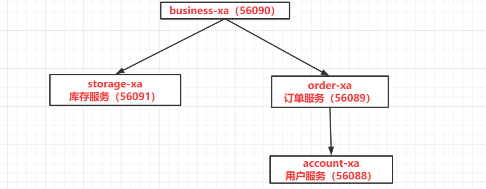
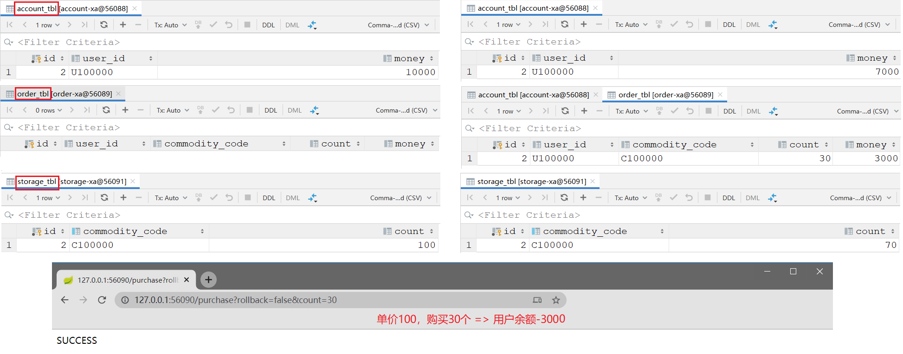

1.  https://github.com/seata/seata-samples/tree/master/seata-xa 

# Sample of Seata XA mode

Spring Cloud 中使用 Seata，使用 Feign 实现远程调用，使用 Spring JDBC 访问 MySQL 数据库



# 四个服务分别创建四个数据库



## seata-server

```bash
docker run \
--name seata_server \
-p 60000:8091 \
-di seataio/seata-server:1.1.0
```

```bash
### 查看日志
docker logs -f seata_server 
```

## account-xa

```bash
docker run \
--name mysql_dtx_seata_official_account_xa \
--env MYSQL_ROOT_HOST=%.%.%.% \
--env MYSQL_ROOT_PASSWORD=123456 \
-p 56088:3306  \
-di mysql:5.6
```

```bash
jdbc:mysql://121.36.33.154:56088?serverTimezone=UTC
```

```sql
DROP DATABASE IF EXISTS `account_xa`;
CREATE DATABASE `account_xa`;
USE `account_xa`;

DROP TABLE IF EXISTS `account_tbl`;
CREATE TABLE `account_tbl`
(
    `id`      int(11) NOT NULL AUTO_INCREMENT,
    `user_id` varchar(64) DEFAULT NULL,
    `money`   int(11)      DEFAULT 0,
    PRIMARY KEY (`id`)
) ENGINE = InnoDB DEFAULT CHARSET = utf8mb4;

insert into account_tbl(user_id, money) values ('U100000', '10000');
```

## order-xa

```bash
docker run \
--name mysql_dtx_seata_official_order_xa \
--env MYSQL_ROOT_HOST=%.%.%.% \
--env MYSQL_ROOT_PASSWORD=123456 \
-p 56089:3306  \
-di mysql:5.6
```

```bash
jdbc:mysql://121.36.33.154:56089?serverTimezone=UTC
```

```sql
DROP DATABASE IF EXISTS `order_xa`;
CREATE DATABASE `order_xa`;
USE `order_xa`;

DROP TABLE IF EXISTS `order_tbl`;
CREATE TABLE `order_tbl`
(
    `id`             int(11) NOT NULL AUTO_INCREMENT,
    `user_id`        varchar(64) DEFAULT NULL,
    `commodity_code` varchar(64) DEFAULT NULL,
    `count`          int(11)      DEFAULT 0,
    `money`          int(11)      DEFAULT 0,
    PRIMARY KEY (`id`)
) ENGINE = InnoDB DEFAULT CHARSET = utf8mb4;
```

## storage-xa

```bash
docker run \
--name mysql_dtx_seata_official_storage_xa \
--env MYSQL_ROOT_HOST=%.%.%.% \
--env MYSQL_ROOT_PASSWORD=123456 \
-p 56091:3306  \
-di mysql:5.6
```

```bash
jdbc:mysql://121.36.33.154:56091?serverTimezone=UTC
```

```sql
DROP DATABASE IF EXISTS `storage_xa`;
CREATE DATABASE `storage_xa`;
USE `storage_xa`;

DROP TABLE IF EXISTS `storage_tbl`;
CREATE TABLE `storage_tbl`
(
    `id`             int(11) NOT NULL AUTO_INCREMENT,
    `commodity_code` varchar(64) DEFAULT NULL,
    `count`          int(11)      DEFAULT 0,
    PRIMARY KEY (`id`),
    UNIQUE KEY (`commodity_code`)
) ENGINE = InnoDB DEFAULT CHARSET = utf8mb4;

insert into storage_tbl(commodity_code, count) values ('C100000', '100');
```

## 测试 

```bash
### 无错误成功提交
http://127.0.0.1:56090/purchase?rollback=false&count=30
```
基于初始化数据，和默认的调用逻辑，purchase 将可以被成功调用 3 次。

每次账户余额扣减 3000，由最初的 10000 减少到 1000。

第 4 次调用，因为账户余额不足，purchase 调用将失败。相应的：库存、订单、账户都回滚。

## XA 模式

AT 模式使用 DataSourceProxy

```java
@Bean("dataSourceProxy")
public DataSource dataSource(DruidDataSource druidDataSource) {
    // DataSourceProxyXA for XA mode
    // io.seata.rm.datasource.xa.DataSourceProxyXA
    return new DataSourceProxyXA(druidDataSource);
}
```


## XA 模式日志

```bash
### docker logs -f seata_server 

```

```bash
### business-xa

### storage-xa

### order-xa

### account-xa
```


# 异常处理

```
java.lang.NoSuchMethodException: com.mysql.cj.conf.PropertySet.getBooleanReadableProperty(java.lang.String)
```

```xaml
<druid-starter.version>1.1.24</druid-starter.version>
<!-- 
	高版本确实没有这个方法，切换到低版本 
-->
<druid-starter.version>1.1.10</druid-starter.version>
```


MySQL切换到低版本 5.X


seata-server-0.7.1

seata-server.bat -p 60000 -m file


````bash
docker stop mysql_dtx_seata_official_order_xa && docker rm mysql_dtx_seata_official_order_xa;
docker stop mysql_dtx_seata_official_storage_xa && docker rm mysql_dtx_seata_official_storage_xa;
docker stop mysql_dtx_seata_official_account_xa && docker rm mysql_dtx_seata_official_account_xa;
````


```
docker start mysql_dtx_seata_official_order_xa;
docker start mysql_dtx_seata_official_storage_xa;
docker start mysql_dtx_seata_official_account_xa;
docker start seata_server;
```


